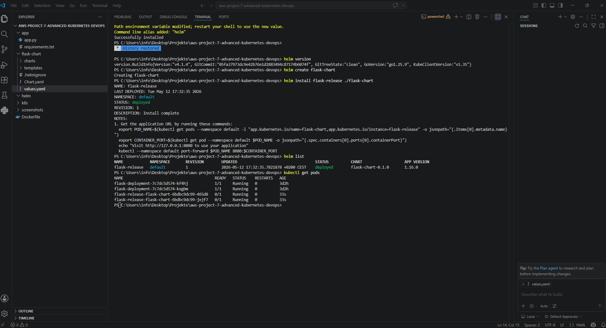
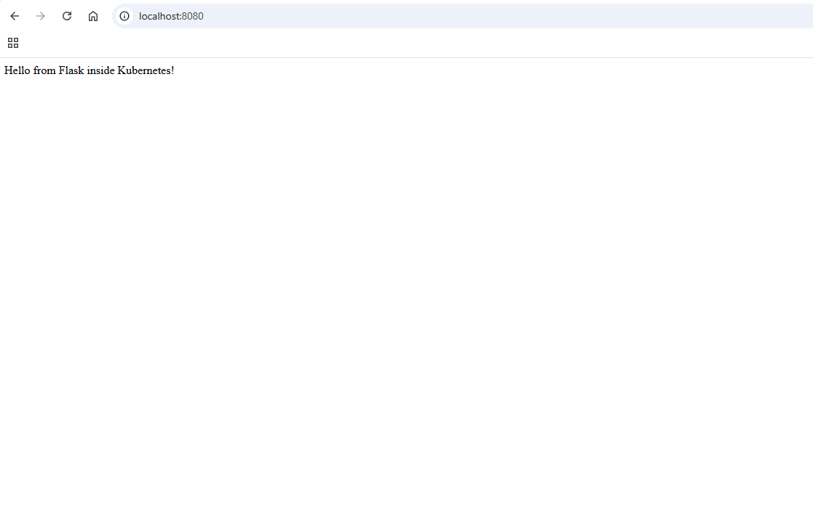
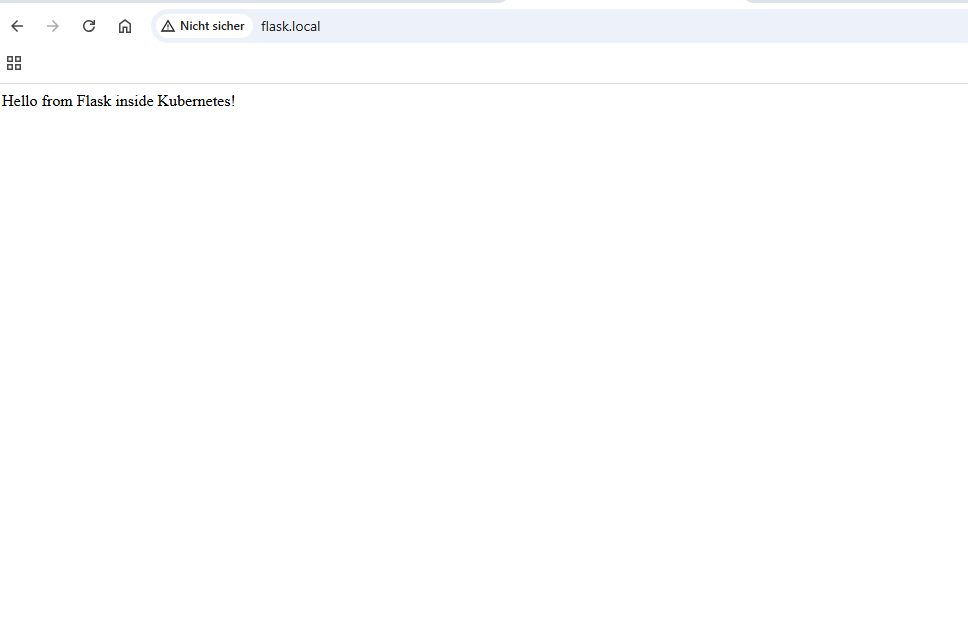
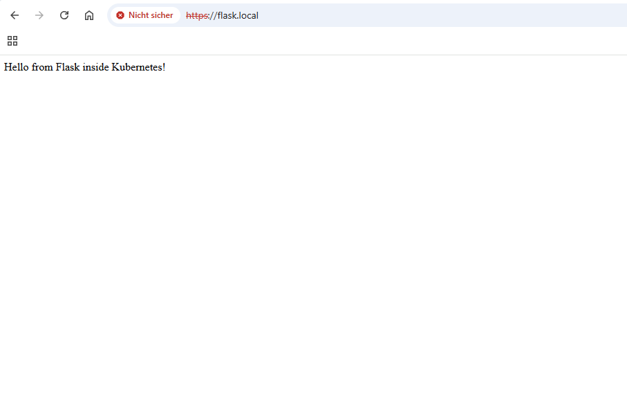
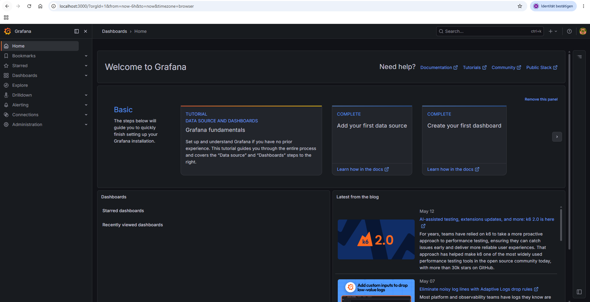
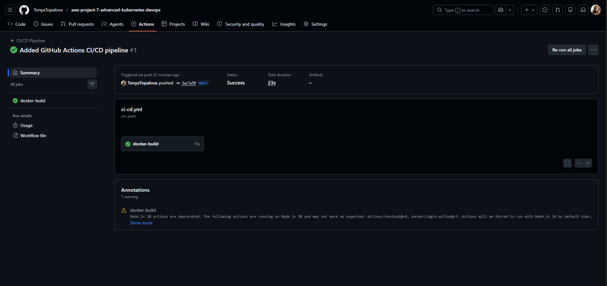

# AWS Project 7 - Advanced Kubernetes DevOps Platform

## Project Overview

This project extends my Kubernetes Flask deployment into a more advanced production-style DevOps platform.

The project demonstrates modern DevOps and Cloud Engineering concepts including:

- Kubernetes
- Helm Charts
- Kubernetes Ingress
- HTTPS / TLS
- cert-manager
- Monitoring
- Prometheus
- Grafana
- GitHub Actions CI/CD
- Docker Hub Integration

The goal of this project was to simulate a production-ready Kubernetes environment with monitoring, automation, and secure application routing.

---

## Technologies Used

- Python
- Flask
- Docker
- Kubernetes
- Helm
- NGINX Ingress Controller
- cert-manager
- Prometheus
- Grafana
- GitHub Actions
- Docker Hub
- Git
- Linux
- YAML

---

## Project Architecture

```text
User Browser
       │
       ▼
Ingress Controller
       │
       ▼
Kubernetes Service
       │
       ▼
Flask Application Pods
       │
       ▼
Docker Container
       │
       ▼
Kubernetes Cluster
```

---

## Project Structure

```text
aws-project-7-advanced-kubernetes-devops/
│
├── app/
│   ├── app.py
│   └── requirements.txt
│
├── flask-chart/
│   ├── templates/
│   ├── Chart.yaml
│   └── values.yaml
│
├── .github/
│   └── workflows/
│       └── ci-cd.yml
│
├── screenshots/
│
├── Dockerfile
├── .gitignore
└── README.md
```

---

## Docker Setup

### Build Docker Image

```bash
docker build -t flask-k8s-app .
```

### Run Docker Container

```bash
docker run -p 5000:5000 flask-k8s-app
```

---

## Docker Hub Integration

### Tag Docker Image

```bash
docker tag flask-k8s-app tonyatopalova/flask-k8s-app:latest
```

### Push Docker Image

```bash
docker push tonyatopalova/flask-k8s-app:latest
```

---

## Helm Deployment

### Create Helm Chart

```bash
helm create flask-chart
```

### Install Helm Release

```bash
helm install flask-release ./flask-chart
```

### Upgrade Helm Deployment

```bash
helm upgrade flask-release ./flask-chart
```

---

## Kubernetes Ingress

The application was configured with Kubernetes Ingress using the NGINX Ingress Controller.

Example local domain:

```text
http://flask.local
```

---

## HTTPS / TLS

HTTPS was configured using:

- cert-manager
- TLS certificates
- Kubernetes Ingress TLS configuration

Example:

```text
https://flask.local
```

---

## Monitoring Stack

The project includes a complete monitoring setup using:

- Prometheus
- Grafana
- Kubernetes Monitoring Stack

### Grafana Access

```text
http://localhost:3000
```

---

## GitHub Actions CI/CD

This project includes a GitHub Actions CI/CD pipeline.

The pipeline automatically:

- Builds Docker images
- Pushes images to Docker Hub
- Simulates Kubernetes deployment updates

Workflow file:

```text
.github/workflows/ci-cd.yml
```

---

## Important Kubernetes Commands

### Check Pods

```bash
kubectl get pods
```

### Check Services

```bash
kubectl get services
```

### Check Ingress

```bash
kubectl get ingress
```

### Port Forward Grafana

```bash
kubectl port-forward svc/monitoring-grafana -n monitoring 3000:80
```

---

## Project Screenshots

### Helm Release Running



---

### Flask Application with Helm



---

### Ingress with flask.local



---

### HTTPS Enabled Flask Application



---

### Grafana Monitoring Dashboard



---

### GitHub Actions CI/CD Pipeline



---

## Learning Outcomes

Through this project I learned:

- Advanced Kubernetes concepts
- Helm chart management
- Kubernetes Ingress routing
- HTTPS and TLS configuration
- cert-manager integration
- Kubernetes monitoring
- Grafana dashboards
- Prometheus metrics
- GitHub Actions automation
- CI/CD pipelines
- Production-style DevOps workflows

---

## Future Improvements

Possible future improvements:

- AWS EKS
- Real public domain
- Route53
- Load Balancer
- ArgoCD
- Terraform
- Kubernetes autoscaling

---

## Author

Tonya Topalova